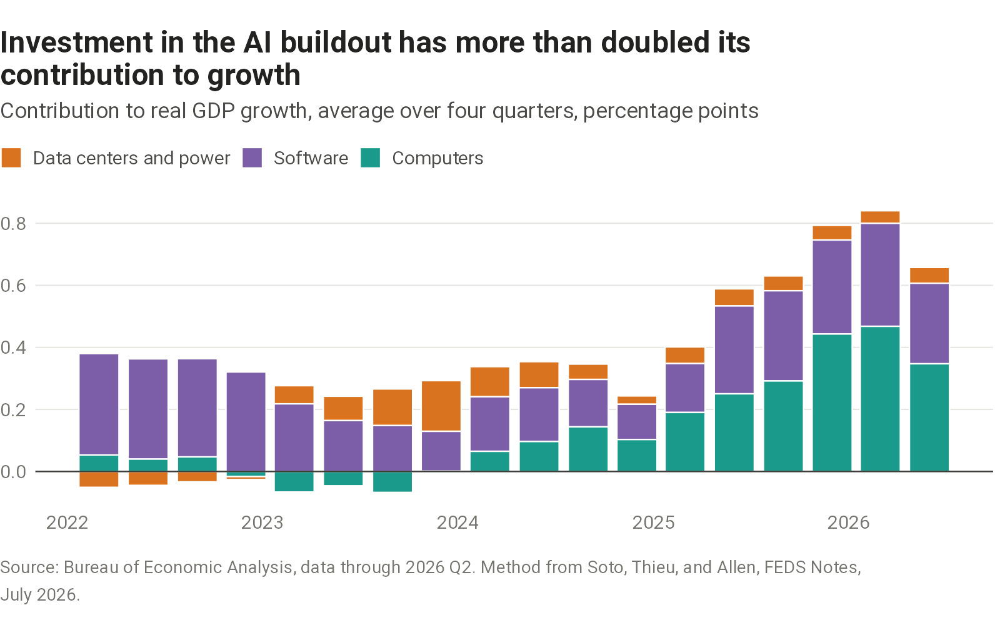
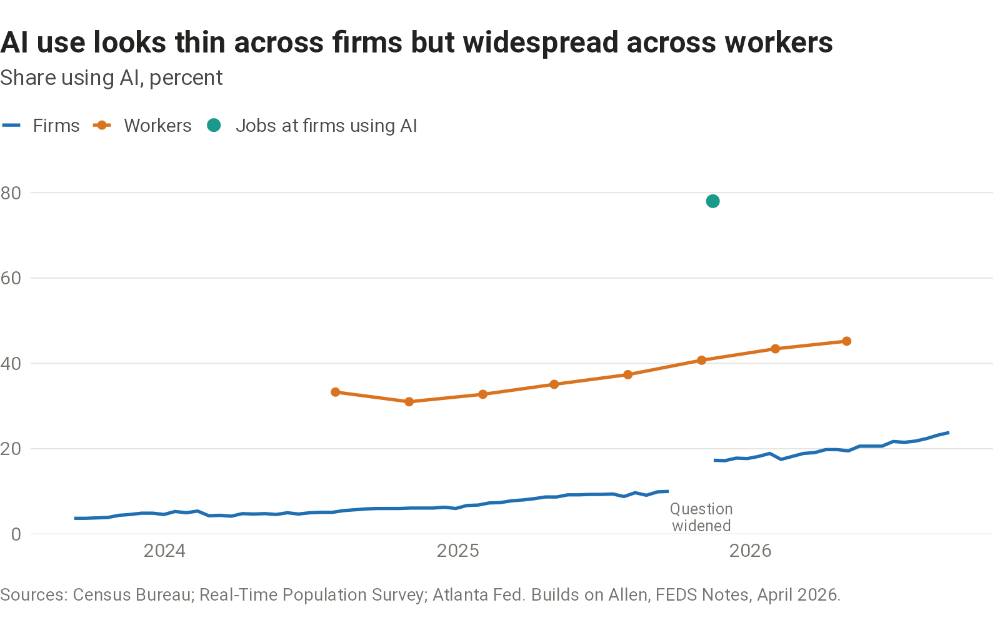
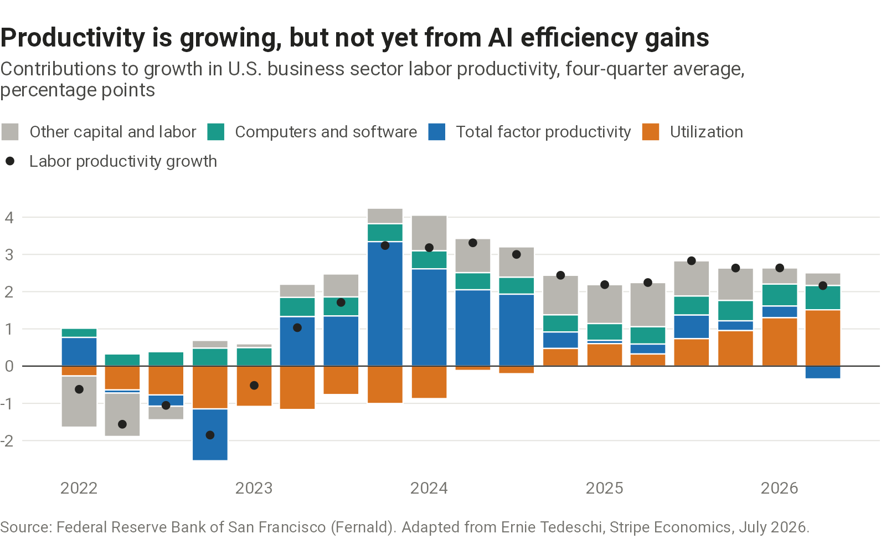

What AI is and is not doing to the U.S. economy right now.

## Investment



```{=html}
<picture>
  <source media="(max-width: 600px)" srcset="charts/ai-investment-gdp/output/ai-investment-gdp-narrow.png">
  
</picture>
```

::: {.chart-source}
[Sources, definitions, and data](sources.qmd#ai-investment-gdp)
:::

## Adoption



```{=html}
<picture>
  <source media="(max-width: 600px)" srcset="charts/ai-adoption/output/ai-adoption-narrow.png">
  
</picture>
```

::: {.chart-source}
[Sources, definitions, and data](sources.qmd#ai-adoption)
:::

## Productivity



```{=html}
<picture>
  <source media="(max-width: 600px)" srcset="charts/productivity-decomposition/output/productivity-decomposition-narrow.png">
  
</picture>
```

::: {.chart-source}
[Sources, definitions, and data](sources.qmd#productivity-decomposition)
:::
