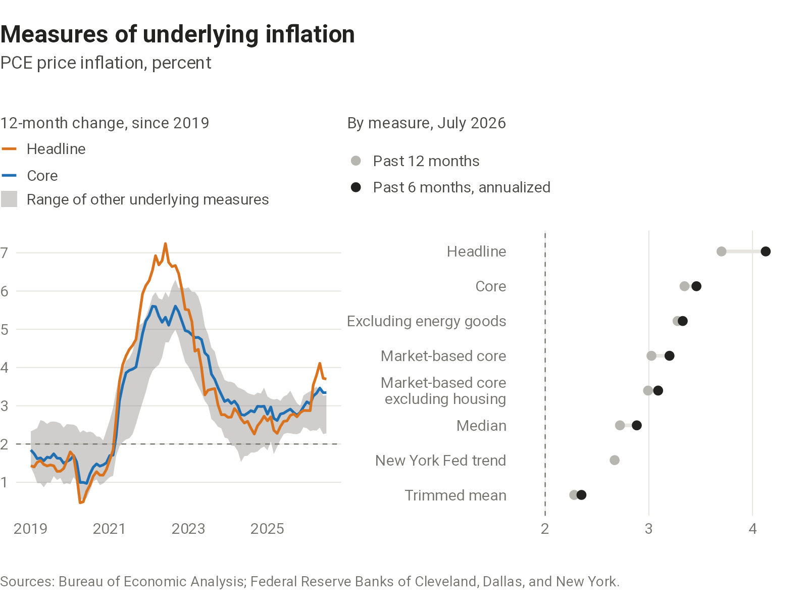

Charts on U.S. consumer price inflation.

## Underlying inflation

Measures of underlying inflation set aside volatile or unusual price changes to gauge where inflation is heading, and the Federal Reserve watches several of them. They are built differently and can give different readings, so the chart shows them together, over time and for the latest month.

```{=html}
<picture>
  <source media="(max-width: 600px)" srcset="charts/inflation-measures/output/inflation-measures-narrow.png">
  
</picture>
```

::: {.chart-source}
[Sources, definitions, and data](sources.qmd#inflation-measures)
:::

## Breadth

Price increases spread across many categories are harder to attribute to a few one-off shocks than increases concentrated in a few. Kevin Warsh [cited this measure](https://www.federalreserve.gov/newsevents/speech/warsh20260828a.htm) at Jackson Hole in August 2026.

```{=html}
<picture>
  <source media="(max-width: 600px)" srcset="charts/inflation-breadth/output/inflation-breadth-narrow.png">
  
</picture>
```

::: {.chart-source}
[Sources, definitions, and data](sources.qmd#inflation-breadth)
:::
