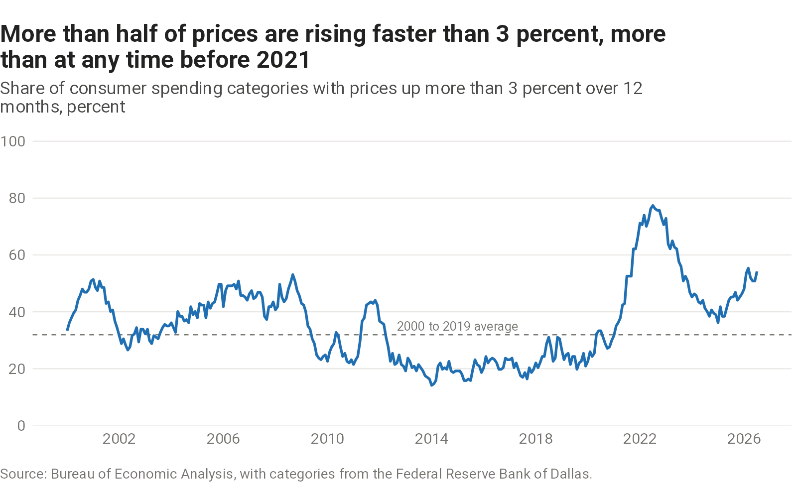

How high underlying inflation is, and what is driving it.

## Underlying inflation



```{=html}
<picture>
  <source media="(max-width: 600px)" srcset="charts/inflation-measures/output/inflation-measures-narrow.png">
  
</picture>
```

::: {.chart-source}
[Sources, definitions, and data](sources.qmd#inflation-measures)
:::

## Breadth



```{=html}
<picture>
  <source media="(max-width: 600px)" srcset="charts/inflation-breadth/output/inflation-breadth-narrow.png">
  
</picture>
```

::: {.chart-source}
[Sources, definitions, and data](sources.qmd#inflation-breadth)
:::
