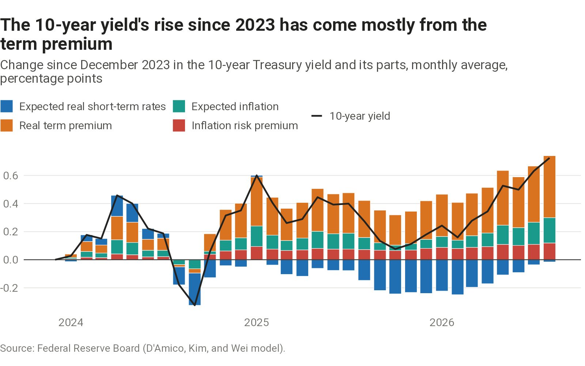
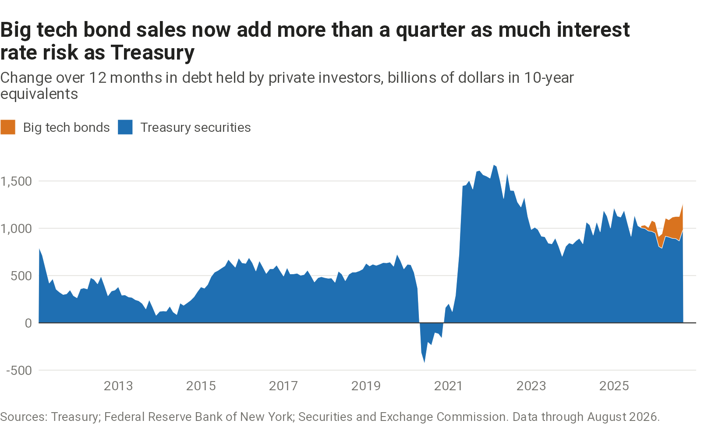

What is driving long-term U.S. interest rates.

## The 10-year yield



```{=html}
<picture>
  <source media="(max-width: 600px)" srcset="charts/term-premium/output/term-premium-narrow.png">
  
</picture>
```



## Who is supplying long-term debt



```{=html}
<picture>
  <source media="(max-width: 600px)" srcset="charts/duration-supply/output/duration-supply-narrow.png">
  
</picture>
```


