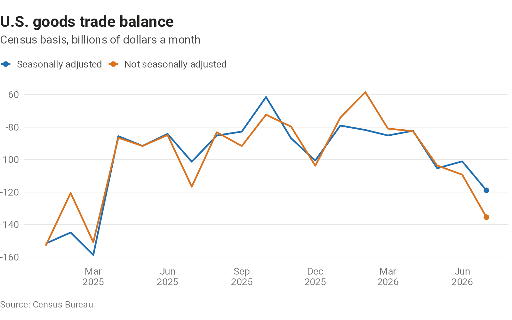
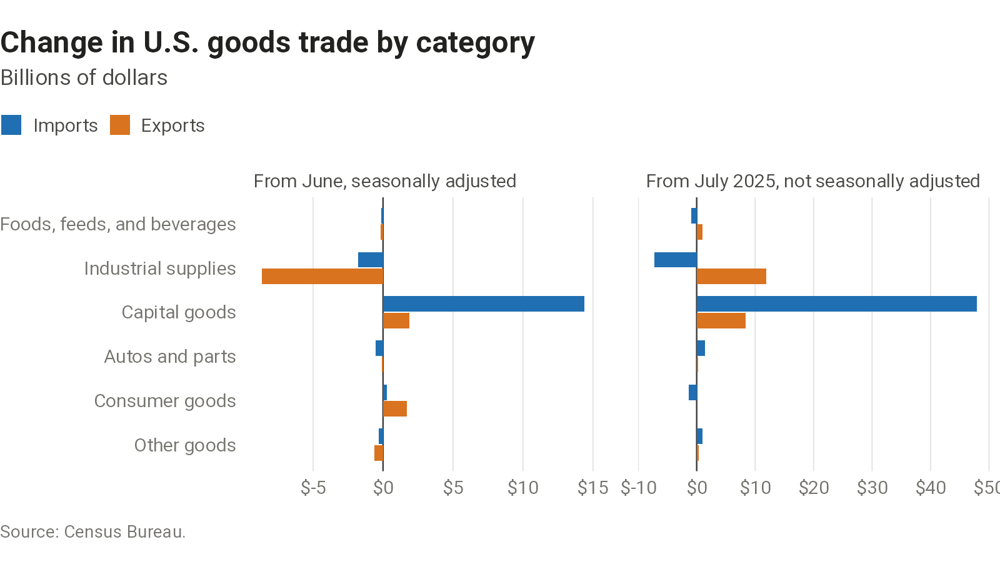
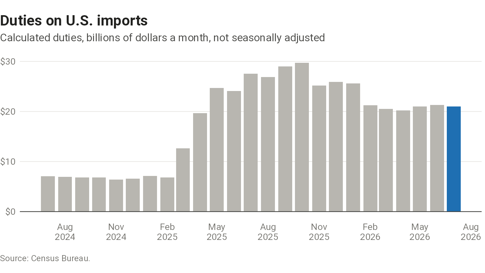



A view of the latest monthly report on U.S. international trade in goods and services from the Census Bureau and the Bureau of Economic Analysis. Seasonal adjustment of trade data has been harder since 2020, so where the data allow, the page shows figures both seasonally adjusted and not: the first compare with the previous month, the second with the same month a year earlier.

## Headline

Seasonally adjusted, balance of payments basis, billions of dollars. The previous month is as revised in this release.



```{=html}

```

## By category

Change in exports and imports by end-use category, seasonally adjusted from the previous month and not seasonally adjusted from a year earlier.

```{=html}

```

## By product

The ten detailed end-use categories with the largest change in dollars from a year earlier, for imports and for exports. Census does not seasonally adjust trade at this detail.

```{=html}

```

## Tariffs

Duties calculated on imports each month, and for the ten countries whose imports paid the most duty in the latest month. The tariff rate is duties as a percent of the customs value of imports for consumption.

```{=html}

```



::: {.chart-source}
Source: Census Bureau, U.S. International Trade in Goods and Services (FT-900), exhibits 1 and 6, and U.S. imports and exports of merchandise by end-use category and by product. Data: [goods balance](charts/trade-release/output/goods-balance.csv), [categories](charts/trade-release/output/end-use-changes.csv), [products](charts/trade-release/output/product-changes.csv), [duties](charts/trade-release/output/duties.csv).
:::
