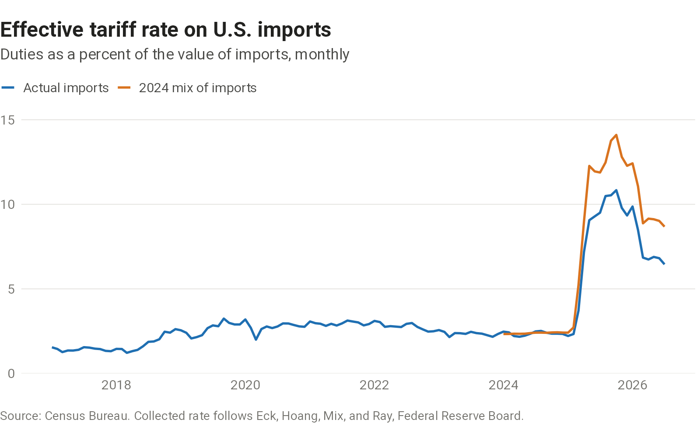

Charts on U.S. trade and tariffs.

## Tariff rates

Announced tariffs and the duties importers pay can differ, because of exemptions, claims under trade agreements, and shifts in what the United States buys and from where. A [Federal Reserve Board note](https://www.federalreserve.gov/econres/notes/feds-notes/mind-the-gap-announced-versus-implied-tariff-rates-in-recent-trade-policy-episodes-20260408.html) by Sydney Eck, Trang Hoang, Carter Mix, and Madeleine Ray measures that difference; the chart shows the rate collected on actual imports and, to set aside shifts in the mix, at the products and countries the United States imported in 2024. Both count duty when goods enter, before any refunds, such as those after the Supreme Court's February 2026 ruling on emergency tariffs.

```{=html}
<picture>
  <source media="(max-width: 600px)" srcset="charts/effective-tariff-rate/output/effective-tariff-rate-narrow.png">
  
</picture>
```

::: {.chart-source}
[Sources, definitions, and data](sources.qmd#effective-tariff-rate)
:::
